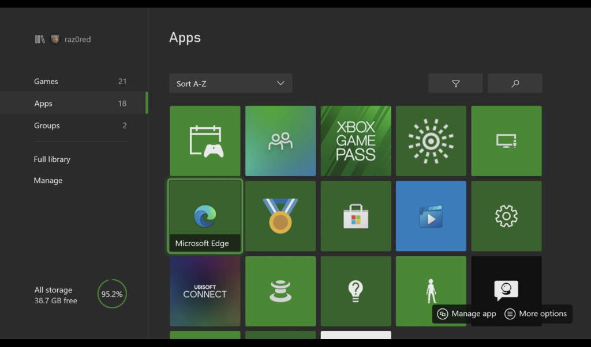
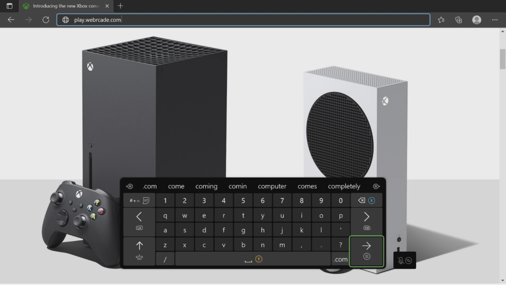
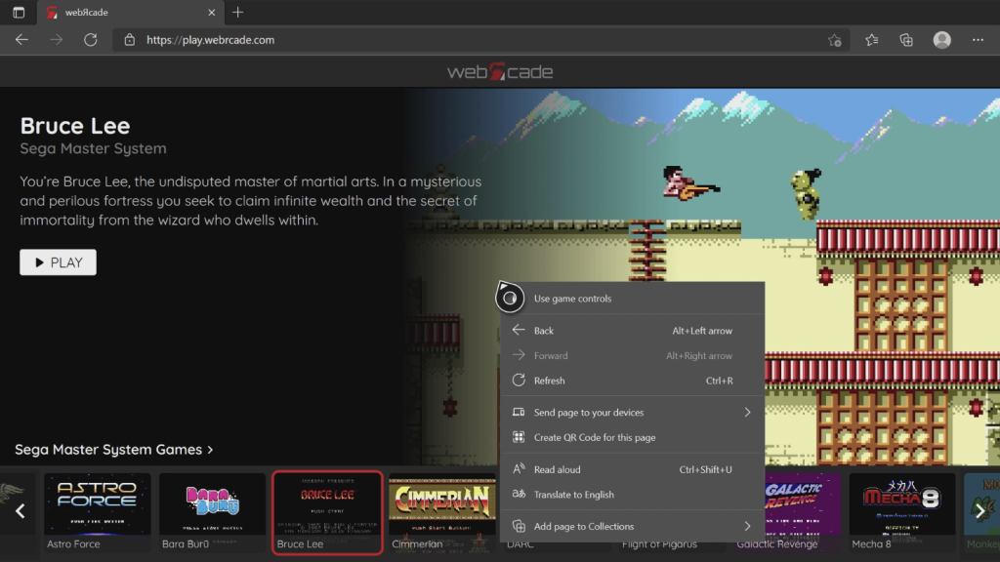
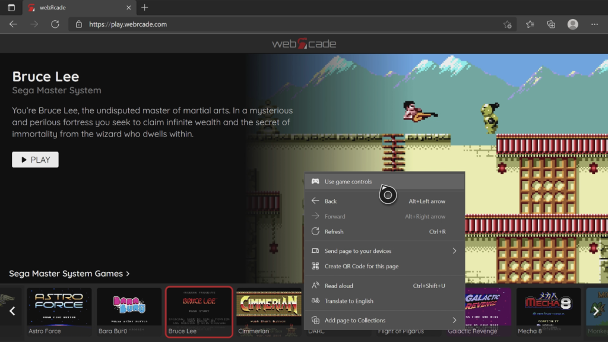
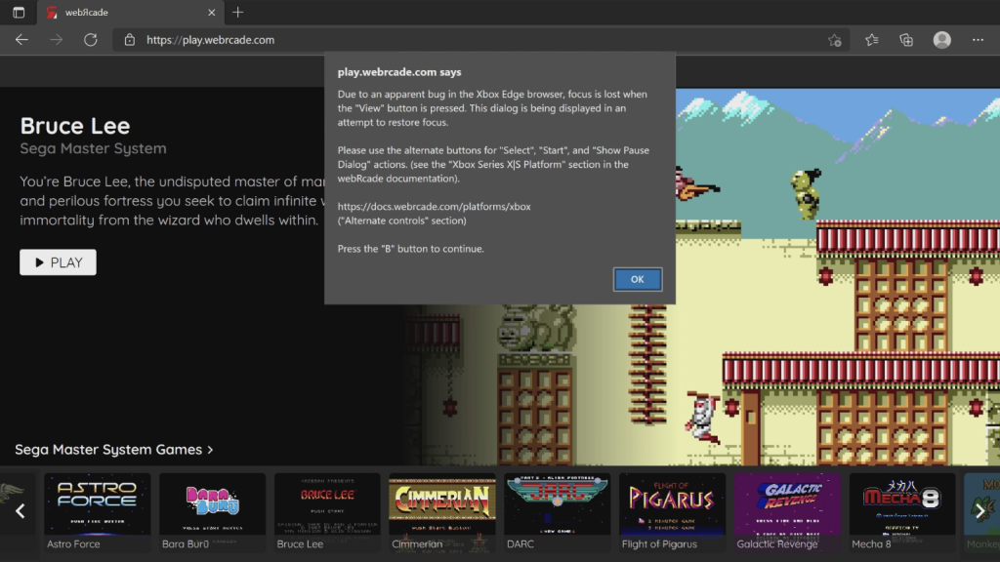

# Xbox Series X|S

## Overview

This page provides information on how to obtain the optimal experience when using webЯcade with the Xbox Series X|S game consoles. It is important to note that while webЯcade is functional on previous generations of Xbox One consoles, there will most likely be significant performance issues.

!!! note
    The Xbox Series X|S Edge browser was recently updated to use Blink as its browser engine
    (part of Chomium). As this is a very recent change, several defects have been detected
    and reported (see [View button defect](#view-button-defect), below). This page will be updated
    to reflect newly reported bugs and if previous defects have been resolved. 

## Browser Support

The recommended browser for use with webЯcade on Xbox Series X|S consoles is Microsoft Edge which is based on the Blink browser engine. There are other browsers available on the Xbox, but they all appear to use the EdgeHTML browser core which is less performant.

## Launching webЯcade

To launch webЯcade, perform the following steps:

* Press the :fontawesome-brands-xbox: `Xbox` button on the controller to open the guide on the left side of the screen.
* Select the `"My games and apps"` option.
* Select the `"See all"` option.
* A screen similar to the one shown below should be displayed.

{: style="padding:5px 15px;" class="center"}

* Select the `"Apps"` category on the left.
* Select the `"Microsoft Edge"` application.

{: style="padding:5px 15px;" class="center"}

* The `"Microsoft Edge"` browser should be launched and appear similar to the screen above.
* Use the left analog stick to navigate to the address bar (see screen above).
* Once the address is highlighted, press the `A` button.

{: style="padding:5px 15px;" class="center"}

* At this point the text entry screen should be displayed (see screen above).
* Enter the following address: `"play.webrcade.com"`

{: style="padding:5px 15px;" class="center"}

* At this point, the webЯcade front-end should be displayed (see screen above).
* The `"Game controls"` input mode should be selected by default, allowing for navigating the front-end via the controller. If this is not the case, refer to the ["Game and Browsing Controls"](#game-and-browsing-controls) section below.

## Alternate controls

Due to defects (see [View button defect](#view-button-defect), below) present in the recently introduced Blink-based Microsoft Edge browser for the Xbox Series X|S, the following alternate inputs are highly-recommended to trigger the `Start`, `Select`, and `Show Pause Screen` actions.

| __Name__ | 
__Gamepad__
 | __Comments__ |
| --- | --- | --- |
| Start            | {: class="control"} &nbsp;and&nbsp; {: class="control"} | Hold down the __Right Trigger__ and click (press down) on the __Right Thumbstick__. |
| Select           | {: class="control"} &nbsp;and&nbsp; {: class="control"} | Hold down the __Right Trigger__ and click (press down) on the __Left Thumbstick__. |
| Show Pause Screen         | {: class="control"} &nbsp;and&nbsp; {: class="control"} | Hold down the __Left Trigger__ and click (press down) on the __Left Thumbstick__. |
| Show Pause Screen (Alternate)        | {: class="control"} &nbsp;and&nbsp; {: class="control"} | Hold down the __Left Trigger__ and click (press down) on the __Right Thumbstick__. |

## Game and Browsing Controls

The Microsoft Edge browser for Xbox support two distinct control modes, `Game` and `Browsing`. `Game` mode is used when navigating the webЯcade front-end or playing games. The `Browsing` mode can be used to access the navigation bar at the top (address, settings, etc.).

Holding down the :material-microsoft-xbox-controller-menu: `Menu` button when in `Game` mode will switch to `Browsing` mode and display a context menu similar to the one shown in the screen below.

{: style="padding:5px 15px;" class="center"}

To switch to `Game` from `Browsing` mode, hold down on the :material-microsoft-xbox-controller-menu: `Menu` button until the context menu is displayed. At that point use the left analog stick to hover over the `Use game controls` option and then press the `A` button (see screen below).

{: style="padding:5px 15px;" class="center"}

## Full Screen Mode

The :material-microsoft-xbox-controller-view: `View` button can be used to toggle between "Full Screen" and "Standard" (with top navigation bar) display modes.

Hold down the :material-microsoft-xbox-controller-view: `View` button when in tabbed mode to switch to full screen mode (see screen below).

{: style="padding:5px 15px;" class="center"}

!!! note
    Due to a defect related to the view button (see [View button defect](#view-button-defect), below),
    the alert dialog shown in the screen above will be displayed each time the view button is pressed. 
    This alert dialog attempts to work around an issue where pressing the view button causes the current
    page to lose focus. When presented with this alert dialog, simply click the `B` button to close it.    

Hold down the :material-microsoft-xbox-controller-view: `View` button when in full screen mode to switch back to tabbed mode.

## Troubleshooting

Unfortunately, there may be times when webЯcade ceases to work correctly within the Microsoft Edge application. The following sections describe various mechanisms that can be used in an attempt to address such issues.

### View Button Defect

A defect currently exists in the recently released Microsoft Edge browser for Xbox that results in 
focus being lost from the current page when the :material-microsoft-xbox-controller-view: `View`
button is pressed. This ultimately results in the controller no longer being able to navigate the webЯcade
front-end or related screens. 

When webЯcade detects that this issue is about to occur, the alert dialog shown in the screen below will be displayed. Simply click the `B` button to dismiss the dialog, and focus should be correctly restored (the
controller should be able to navigate the front-end and screens).

If the issue is not resolved after dismissing the dialog, refer to the other methods that are documented
in this troubleshooting section.

{: style="padding:5px 15px;" class="center"}

### Display Guide

Sometimes simply opening and closing the Guide menu (press the :fontawesome-brands-xbox: `Xbox` button on the controller) can resolve issues. For example, opening and closing the guide will typically restore focus to the page after it has been inadvertently lost (see [View button defect](#view-button-defect), above).

{: style="padding:5px 15px;" class="center"}

### Refresh Page

Another option is to refresh the webЯcade page. To refresh the page, perform the following steps:

* Switch to `Browsing` mode (See ["Game and Browsing Controls"](#game-and-browsing-controls) section).
* Use the left analog stick to move the cursor over the :material-refresh:  `Refresh` icon in the navigation bar.
* Press the `A` button to perform the refresh.

### Close and Add New Tab

There are times when refreshing the webЯcade page still does not result in proper behavior. When this occurs you can attempt the following steps:

* Switch to `Browsing` mode (See ["Game and Browsing Controls"](#game-and-browsing-controls) section).
* Use the left analog stick to move the cursor over the `x` button on the webЯcade tab to close it.
* Create a new tab with the `+` button (if other tabs were present) and navigate to `play.webrcade.com`.

### Close and Relaunch Edge

Another option is to close the Microsoft Edge application and relaunch it. To relaunch the application, perform the following steps:

* Press the  :fontawesome-brands-xbox:  `Xbox` button on the controller to open the guide on the left side of the screen.
* Navigate and highlight the `Microsoft Edge` application.
* Press the :material-microsoft-xbox-controller-menu: `Menu` button to display the context menu.
* Select the `Quit` option.
* Select the `Microsoft Edge` application and press the `A` button to launch it.

