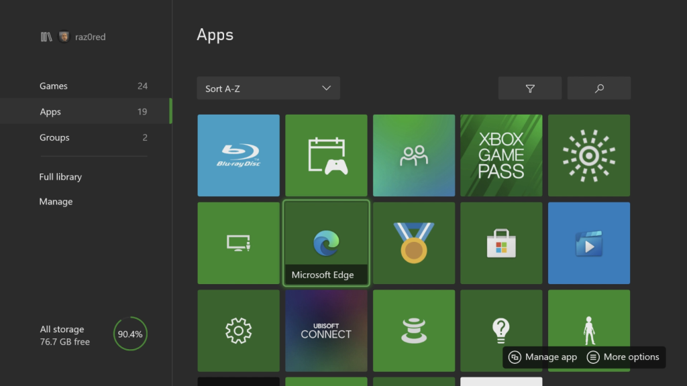
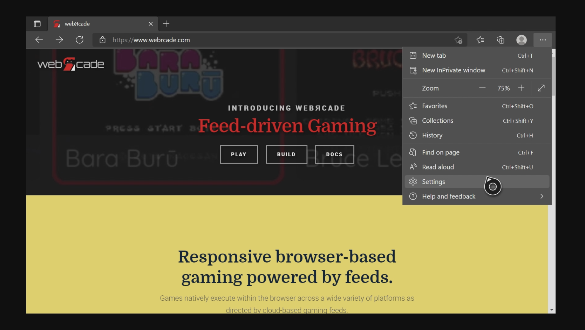
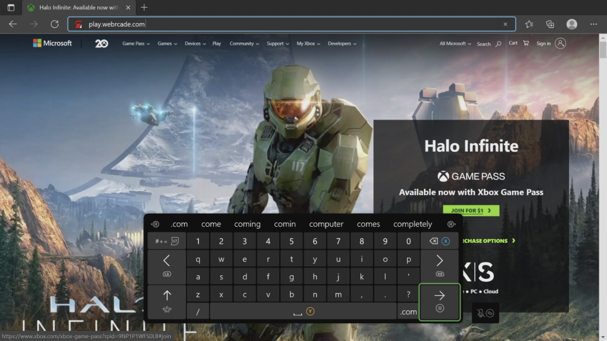
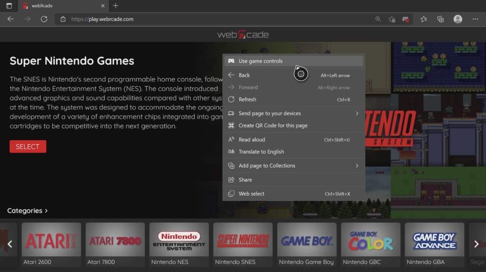
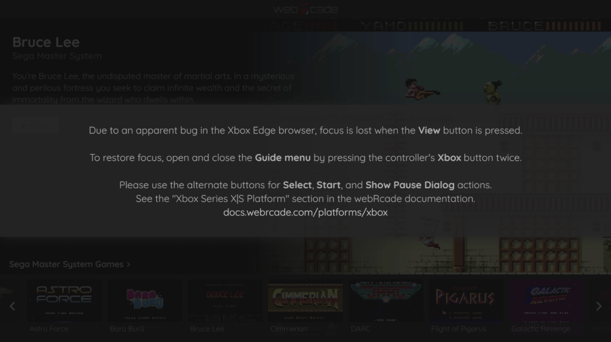

# Xbox Series X|S

## Overview

This page provides information on how to obtain the optimal experience when using webЯcade with the Xbox Series X|S game consoles. 

*It is important to note that while webЯcade is fully functional on previous generations of Xbox One consoles, there will most likely be performance issues.*

!!! note
    The Xbox Series X|S Edge browser was recently updated to use Blink as its browser engine
    (part of Chromium). As this is a very recent change, several defects have been detected
    and reported (see [View button defect](#view-button-defect), below). This page will be updated
    to reflect newly reported bugs and if previous defects have been resolved. 

## Browser Support

The recommended browser for use with webЯcade on Xbox Series X|S consoles is Microsoft Edge which is based on the Blink browser engine. There are other browsers available on the Xbox, but they all appear to use the EdgeHTML browser core which is less performant.

## Launching webЯcade

To launch webЯcade, perform the following steps:

* Press the :fontawesome-brands-xbox: `Xbox` button on the controller to open the guide on the left side of the screen.
* Select the `"My games and apps"` option.
* Select the `"See all"` option.
* A screen similar to the one shown below should be displayed.

{: style="margin:5px; border: 1px solid #666" class="center zoomD"}

* Select the `"Apps"` category on the left.
* Select the `"Microsoft Edge"` application.

{: style="margin:5px; border: 1px solid #666" class="center zoomD"}

* The `"Microsoft Edge"` browser should be launched and appear similar to the screen above.

{: style="margin:5px; border: 1px solid #666" class="center zoomD"}

Prior to navigating to webЯcade, it is critical to ensure that Microsoft Edge does not have *borders* enabled. It is not clear why, but having *borders* enabled causes significant performance issues. 

To check whether *borders* are enabled, perform the following steps:

* Click the *more options* icon (:material-dots-horizontal:) on the right side of the navigation bar (see screen above).
* Then, click the *Settings* icon (:material-cog-outline:) (see screen above).

{: style="margin:5px; border: 1px solid #666" class="center zoomD"}

* Click the *System* icon (:fontawesome-solid-desktop:) within the left navigation bar (see screen above).
* Click the *Link* icon (:octicons-link-external-16:) on the right side of the *Hide border* group within the *System* settings section (see screen above).

{: style="margin:5px; border: 1px solid #666" class="center zoomD"}

* Ensure that the *Apps can add a border* checkbox is disabled within the *Overscan border* section (or uncheck if currently enabled) (see screen above).
* Press the `B` button twice to return to the Microsoft Edge browser.

{: style="margin:5px; border: 1px solid #666" class="center zoomD"}

* At this point, we can go ahead and launch webЯcade. 
* Use the left analog stick to navigate to the address bar (see screen above).
* Once the address is highlighted, press the `A` button.

{: style="margin:5px; border: 1px solid #666" class="center zoomD"}

* At this point the text entry screen should be displayed (see screen above).
* Enter the following address: `"play.webrcade.com"`

{: style="margin:5px; border: 1px solid #666" class="center zoomD"}

* At this point, the webЯcade player should be displayed (see screen above).
* Unfortunately, at the time of this writing, the Edge browser defaults to `Browsing Controls` mode (versus `Game Controls` mode) when webЯcade is loaded.
    * The current mode can be confirmed by examining the controller icon in the navigation bar (highlighted in red in the screen above). If a red `X` is shown in the bottom-right portion of the controller, the page is currently in `Browsing Controls` mode.  

{: style="margin:5px; border: 1px solid #666" class="center zoomD"}

* WebЯcade continually examines gamepad inputs and attempts to detect when the page is operating in `Browsing Controls` mode. If it determines the page is in `Browsing Controls` mode, the message shown in the screen above will be displayed, prompting for a switch to `Game Controls` mode.

{: style="margin:5px; border: 1px solid #666" class="center zoomD"}

* To switch to `Game Controls` from `Browsing Controls` mode, hold down on the :material-microsoft-xbox-controller-menu: `Menu` button until the context menu is displayed. At that point use the left analog stick to hover over the `Use game controls` option and then press the `A` button (see screen above).

{: style="margin:5px; border: 1px solid #666" class="center zoomD"}

* At this point, the controller icon in the navigation bar (highlighted in red in the screen above) should be light blue in color without the red `X`, indicating that the page is in `Game Controls` mode.

## Alternate controls

Due to defects (see [View button defect](#view-button-defect), below) present in the recently introduced Blink-based Microsoft Edge browser for the Xbox Series X|S, the following alternate inputs are highly-recommended to trigger the `Start`, `Select`, and `Show Pause Screen` actions.

| __Name__ | 
__Gamepad__
 | __Comments__ |
| --- | --- | --- |
| Start            | {: class="control"} &nbsp;and&nbsp; {: class="control"} | Hold down the __Right Trigger__ and click (press down) on the __Right Thumbstick__. |
| Select           | {: class="control"} &nbsp;and&nbsp; {: class="control"} | Hold down the __Right Trigger__ and click (press down) on the __Left Thumbstick__. |
| Show Pause Screen         | {: class="control"} &nbsp;and&nbsp; {: class="control"} | Hold down the __Left Trigger__ and click (press down) on the __Left Thumbstick__. |
| Show Pause Screen (Alternate)        | {: class="control"} &nbsp;and&nbsp; {: class="control"} | Hold down the __Left Trigger__ and click (press down) on the __Right Thumbstick__. |

## Game and Browsing Controls

The Microsoft Edge browser for Xbox supports two distinct control modes, `Game Controls` and `Browsing Controls`. `Game` mode is used when navigating the webЯcade player (front-end) or playing games. The `Browsing` mode can be used to access the navigation bar at the top (address, settings, etc.).

{: style="margin:5px; border: 1px solid #666" class="center zoomD"}

To switch to `Game Controls` from `Browsing Controls` mode, hold down on the :material-microsoft-xbox-controller-menu: `Menu` button until the context menu is displayed. At that point use the left analog stick to hover over the `Use game controls` option and then press the `A` button (see screen above).

{: style="margin:5px; border: 1px solid #666" class="center zoomD"}

* At this point, the controller icon in the navigation bar (highlighted in red in the screen above) should be light blue in color without a red `X`, indicating that the page is in `Game Controls` mode.

Holding down the :material-microsoft-xbox-controller-menu: `Menu` button when in `Game Controls` mode will switch to `Browsing Controls` mode. The controller icon in the navigation bar will have a red `X` in the bottom-right portion of the controller, indicating that the page is currently in `Browsing Controls` mode.

## Full Screen Mode

The :material-microsoft-xbox-controller-view: `View` button can be used to toggle between "Full Screen" and "Standard" (with top navigation bar) display modes.

Hold down the :material-microsoft-xbox-controller-view: `View` button when in standard mode to switch to full screen mode (see screen below).

{: style="margin:5px; border: 1px solid #666" class="center zoomD"}

!!! note
    Due to a defect related to the view button (see [View button defect](#view-button-defect), below),
    the message shown in the screen above will be displayed each time the view button is pressed. This message indicates that the page has lost focus. To regain focus when this occurs, simply open and close the Guide menu (press the :fontawesome-brands-xbox: `Xbox` button on the controller). 

Hold down the :material-microsoft-xbox-controller-view: `View` button when in full screen mode to switch back to standard mode.

## Troubleshooting

Unfortunately, there may be times when webЯcade ceases to work correctly within the Microsoft Edge application. The following sections describe various mechanisms that can be used in an attempt to address such issues.

### View Button Defect

A defect currently exists in the recently released Microsoft Edge browser for Xbox that results in 
focus being lost from the current page when the :material-microsoft-xbox-controller-view: `View`
button is pressed. This ultimately results in the controller no longer being able to navigate the webЯcade player (front-end) or related screens. 

When webЯcade detects that focus has been lost, the message shown in the screen below will be displayed. To regain focus when this occurs, simply open and close the Guide menu (press the :fontawesome-brands-xbox: `Xbox` button on the controller).

If focus has not been restored after opening and closing the guide menu, refer to the other troubleshooting methods described in this section.

{: style="margin:5px; border: 1px solid #666" class="center zoomD"}

### Display Guide

Sometimes simply opening and closing the Guide menu (press the :fontawesome-brands-xbox: `Xbox` button on the controller) can resolve issues. For example, opening and closing the guide will typically restore focus to the page after it has been inadvertently lost (see [View button defect](#view-button-defect), above).

{:style="margin:5px; border: 1px solid #666" class="center zoomD"}

### Refresh Page

Another option is to refresh the webЯcade page. To refresh the page, perform the following steps:

* Switch to `Browsing` mode (See ["Game and Browsing Controls"](#game-and-browsing-controls) section).
* Use the left analog stick to move the cursor over the :material-refresh:  `Refresh` icon in the navigation bar.
* Press the `A` button to perform the refresh.

### Close and Add New Tab

There are times when refreshing the webЯcade page still does not result in proper behavior. When this occurs you can attempt the following steps:

* Switch to `Browsing` mode (See ["Game and Browsing Controls"](#game-and-browsing-controls) section).
* Use the left analog stick to move the cursor over the `x` button on the webЯcade tab to close it.
* Create a new tab with the `+` button (if other tabs were present) and navigate to `play.webrcade.com`.

### Close and Relaunch Edge

Another option is to close the Microsoft Edge application and relaunch it. To relaunch the application, perform the following steps:

* Press the  :fontawesome-brands-xbox:  `Xbox` button on the controller to open the guide on the left side of the screen.
* Navigate and highlight the `Microsoft Edge` application.
* Press the :material-microsoft-xbox-controller-menu: `Menu` button to display the context menu.
* Select the `Quit` option.
* Select the `Microsoft Edge` application and press the `A` button to launch it.

### Performance Issues (Disable Borders)

It is critical to ensure that Microsoft Edge does not have *borders* enabled. It is not clear why, but having *borders* enabled causes significant performance issues. 

{: style="margin:5px; border: 1px solid #666" class="center zoomD"}

To check whether *borders* are enabled, perform the following steps:

* Click the *more options* icon (:material-dots-horizontal:) on the right side of the navigation bar (see screen above).
* Then, click the *Settings* icon (:material-cog-outline:) (see screen above).

{: style="margin:5px; border: 1px solid #666" class="center zoomD"}

* Click the *System* icon (:fontawesome-solid-desktop:) within the left navigation bar (see screen above).
* Click the *Link* icon (:octicons-link-external-16:) on the right side of the *Hide border* group within the *System* settings section (see screen above).

{: style="margin:5px; border: 1px solid #666" class="center zoomD"}

* Ensure that the *Apps can add a border* checkbox is disabled within the *Overscan border* section (or uncheck if currently enabled) (see screen above).

