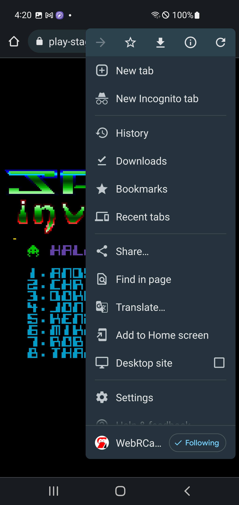

# Stand-alone

## Overview

In addition to playing items (games, etc.) in the [player](../userguide/index.md) and [feed editor](../editor/index.md), webЯcade supports playing a single item (game, etc.) in a *stand-alone mode*.

Stand-alone links can be utilized in various ways:

* [Sharing stand-alone links](#direct-link-sharing-text-messages-email-message-boards) via text-messages, emails, messaging boards, etc.
* Adding stand-alone links to [iOS home screens](#add-to-home-ios-iphoneipad)
* Adding stand-alone links to [Android home screens](#add-to-home-android)
* [Embedding stand-alone links](#embedded) on a web page

### Copy stand-alone link

The process for obtaining a stand-alone link is the same regardless of how the link will be utilized.

{: style="padding:5px;" class="center zoomD"}

To obtain a stand-alone link, perform the following steps:

* Navigate to the feed editor ([https://editor.webrcade.com](https://editor.webrcade.com)).
* Navigate to the "Items" tab of the feed workspace
* Load a feed that contains the item (game, etc.) for which to obtain a stand-alone link (or create a new item)
* Select the item for which to obtain the stand-alone link (*See #1 in screenshot above*)
* Select the "More" action (`"..."`) in the toolbar to reveal the "More" menu (*See #2 in screenshot above*)
* Select the "Copy stand-alone link" menu item (*See #3 in screenshot above*)
* At this point, the *Stand-alone link (URL)* will be copied to the clipboard

## Direct link sharing (text messages, email, message boards)

Once a stand-alone link has been obtained (See [Copy stand-alone link](#copy-stand-alone-link)), it can be easily shared with others via text messages, email, on message boards, etc.

The following is a direct-link to the excellent SNES homebrew game Super Boss Gaiden by Chrono Moogle and Dieter von Laser.

[Stand-alone link (Super Boss Gaiden)](https://play-staging.webrcade.com/app/standalone/?app=app%2Fsnes%2F&props=JTdCJTIydHlwZSUyMiUzQSUyMnNuZXM5eCUyMiUyQyUyMnRpdGxlJTIyJTNBJTIyU3VwZXIlMjBCb3NzJTIwR2FpZGVuJTIyJTJDJTIyYXBwJTIyJTNBJTIyU3VwZXIlMjBOaW50ZW5kbyUyMiUyQyUyMmljb24lMjIlM0ElMjJodHRwcyUzQSUyRiUyRndlYnJjYWRlLmdpdGh1Yi5pbyUyRndlYnJjYWRlLWRlZmF1bHQtZmVlZCUyRmltYWdlcyUyRnNuZXMlMkZzdXBlcmJvc3NnYWlkZW4tdGh1bWIucG5nJTIyJTJDJTIycm9tJTIyJTNBJTIyaHR0cHMlM0ElMkYlMkZyYXcuZ2l0aHVidXNlcmNvbnRlbnQuY29tJTJGd2VicmNhZGUlMkZ3ZWJyY2FkZS1kZWZhdWx0LWZlZWQlMkZtYWluJTJGY29udGVudCUyRnNuZXMlMkZTdXBlciUyMEJvc3MlMjBHYWlkZW4lMjAoSiklMjAoVjEuMikuc2ZjJTIyJTdE&ctx=standalone)

Click on the above stand-alone link to play the game.

## Add to home (iOS, iPhone/iPad)

Stand-alone links can be added directly to an iOS device's home screen, as depicted in the screenshot below.

{: style="padding:5px;" class="center zoomD"}

This particular screenshot shows a collection of stand-alone links that have been added to a group within an iOS device's home screen (along with direct links to the webЯcade player and feed editor).

To add an item (game, etc.) to an iOS device's home screen, perform the following steps:

* Follow the steps detailed above to [Copy a stand-alone link](#copy-stand-alone-link)
* Open Safari and navigate to the stand-alone link (paste into address bar)

{: style="padding:5px; height:700px" class="center zoomD"}

* Tap the :octicons-share-16: `Action (Share)` icon located below the address bar (box with arrow pointing up) (see screenshot above).

{: style="padding:5px; height:700px" class="center zoomD"}

* Select the "`Add to Home Screen`" menu item (*See screenshot above*) to add the item (game, etc.) to the iOS device's home screen

## Add to home (Android)

Stand-alone links can be added directly to an Android device's home screen, as depicted in the screenshot below

{: style="padding:5px;" class="center zoomD"}

This particular screenshot shows a collection of stand-alone links that have been added to an Android device's home screen (along with direct links to the webЯcade player and feed editor).

{: style="padding:5px; height:700px"; class="center zoomD"}

To add an item (game, etc.) to an Android device's home screen, perform the following steps:

* Follow the steps detailed above to [Copy a stand-alone link](#copy-stand-alone-link)
* Open Google Chrome and navigate to the stand-alone link (paste into address bar)
* Tap the :material-dots-vertical: `Kebab Menu (three vertical dots)` icon located to the right of the address bar
* Select the "`Add to home screen`" menu item (*See screenshot above*) to add the item (game, etc.) to the Android device's home screen

## Embedded

Stand-alone links can also be easily embedded within web pages.

The following HTML code block demonstrates how to embed a stand-alone link via an `IFRAME` element.

The `SRC` attribute of the IFRAME contains the stand-alone link (obtained via the [Copy stand-alone link](#copy-stand-alone-link) steps). The `WIDTH` and `HEIGHT` attributes can be adjusted as necessary.

<iframe width="100%" height="300" src="//jsfiddle.net/8mrkqxs2/embedded/html/dark/" allowfullscreen="allowfullscreen" frameborder="0"></iframe>

The result of embedding the HTML code block above is demonstrated below.

<iframe width="100%" height="320" src="//jsfiddle.net/38wamg9y/embedded/result/dark/" allowfullscreen="allowfullscreen" frameborder="0"></iframe>