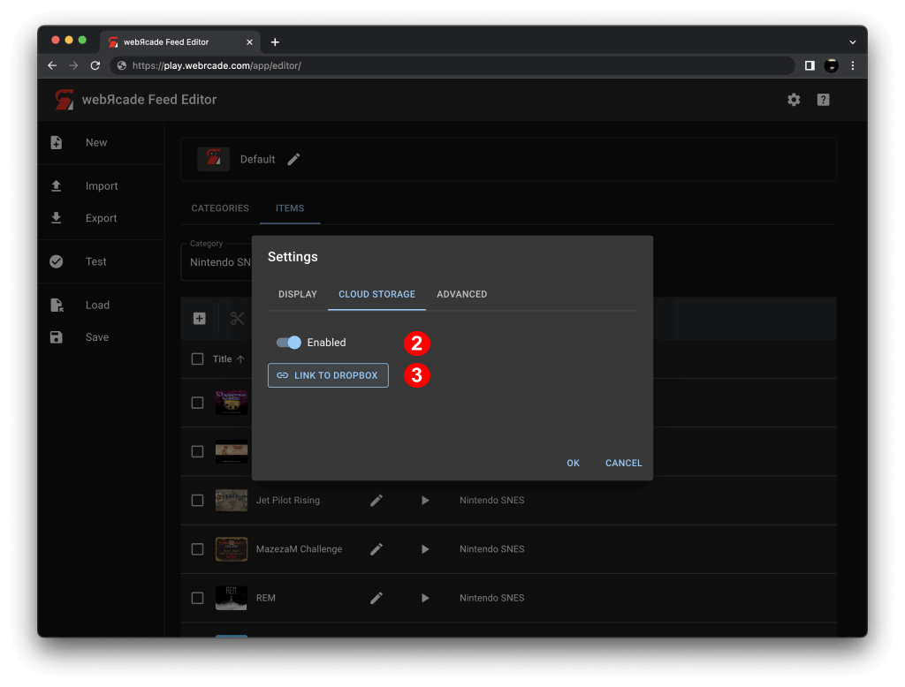
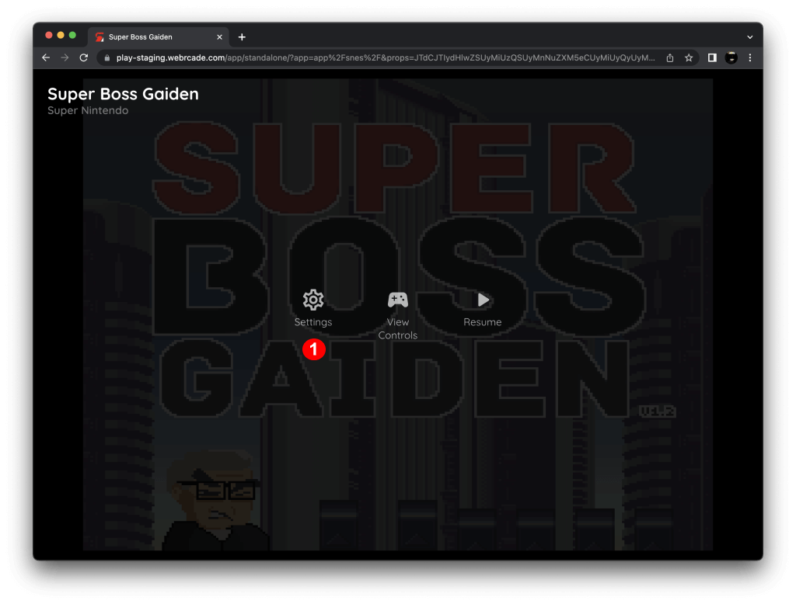
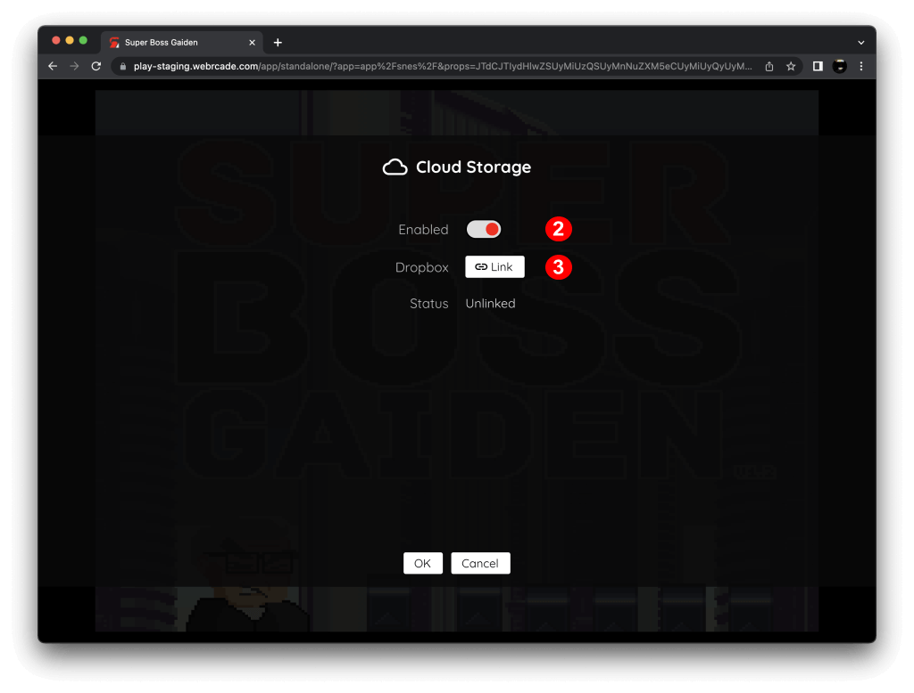
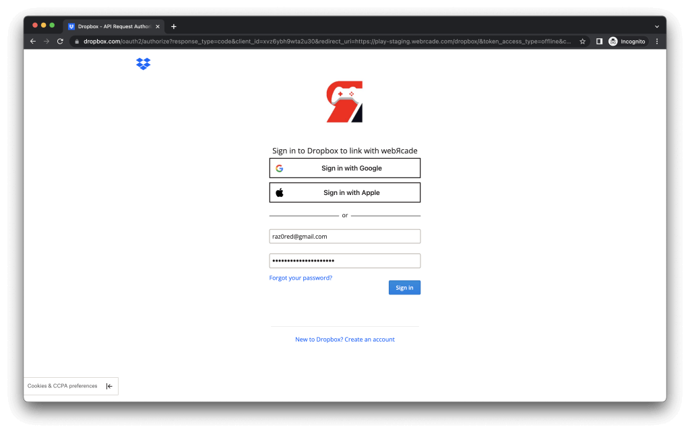

# Cloud Storage

## Overview

WebЯcade optionally supports linking each of your devices and/or browsers to cloud storage (currently limited to [Dropbox](https://www.dropbox.com)) as a means of sharing persistent state information between devices.

Examples of persistent state information include: in-game saves, high scores, hardware configuration settings (for arcade-based systems), etc.

It is important to note that webЯcade only supports in-game state persistence at this time (state that the original game persisted to non-volatile memory). It does not currently support save states. Save states will be coming in a future release.

The following sections detail how to link webЯcade to cloud storage within the WebЯcade [player](#player), [feed editor](#feed-editor), or when playing a game in [stand-alone](#stand-alone) mode.

!!! note
    The cloud storage linking processes described below must be performed once for each unique device
    and/or browser that is being used with webЯcade.

## Player

To enable cloud storage via the *webЯcade player*, perform the steps as detailed below.

{: style="padding:5px;" class="center zoomD"}

Select the "Settings" button (*See #1 in screenshot above*) to display the settings dialog.

{: style="padding:5px;" class="center zoomD"}

Navigate to the "Cloud Storage" tab and perform the following:

* Toggle "Enabled" to on (*#2 in screenshot above*)
* Press the "Link" button (*#3 in screenshot above*)

Once the "Link" button has been pressed, the [Dropbox Linking](#dropbox-linking) screen should be displayed, which walks through the remainder of the linking process.

## Feed Editor

To enable cloud storage via the *webЯcade feed editor*, perform the steps as detailed below.

{: style="padding:5px;" class="center zoomD"}

Select the "Settings" button (*See #1 in screenshot above*) to display the settings dialog.

{: style="padding:5px;" class="center zoomD"}

Navigate to the "Cloud Storage" tab and perform the following:

* Toggle "Enabled" to on (*#2 in screenshot above*)
* Press the "Link to Dropbox" button (*#3 in screenshot above*)

Once the "Link to Dropbox" button has been pressed, the [Dropbox Linking](#dropbox-linking) screen should be displayed, which walks through the remainder of the linking process.

## Stand-alone

To enable cloud storage via the *stand-alone player*, perform the steps as detailed below.

{: style="padding:5px;" class="center zoomD"}

Open the "Pause" screen and then select "Settings" button (*See #1 in screenshot above*) to display the settings dialog.

{: style="padding:5px;" class="center zoomD"}

Navigate to the "Cloud Storage" tab and perform the following:

* Toggle "Enabled" to on (*#2 in screenshot above*)
* Press the "Link" button (*#3 in screenshot above*)

Once the "Link" button has been pressed, the [Dropbox Linking](#dropbox-linking) screen should be displayed, which walks through the remainder of the linking process.

## Dropbox Linking

The Dropbox Linking page walks through the steps necessary to link webЯcade to a Dropbox account.

{: style="padding:5px;" class="center zoomD"}

!!! important
    It is important to note that webЯcade will be restricted to a specific portion of a Dropbox account that has been designated for use by webЯcade (`/Apps/webrcade`). No other locations within Dropbox accounts will be accessible.

The linking process will include authenticating with Dropbox and confirming that
webЯcade is allowed to access a restricted portion of the user's Dropbox account.