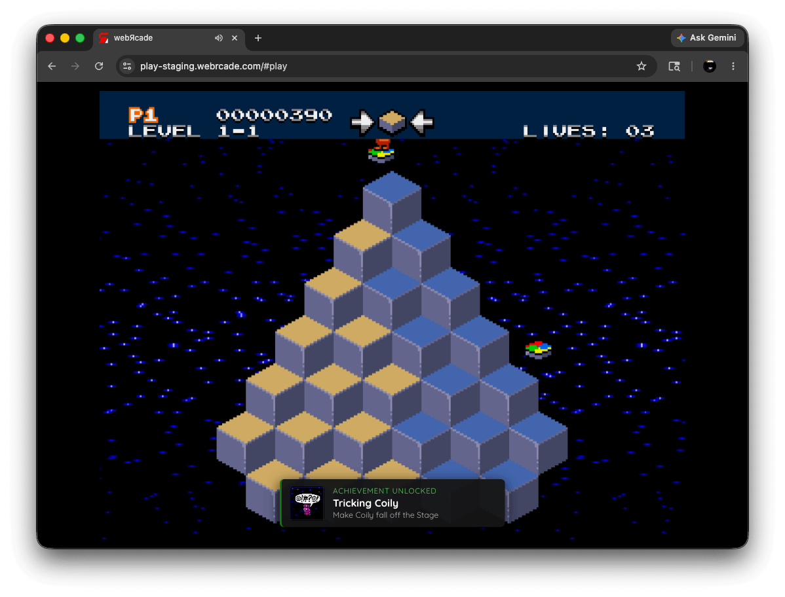
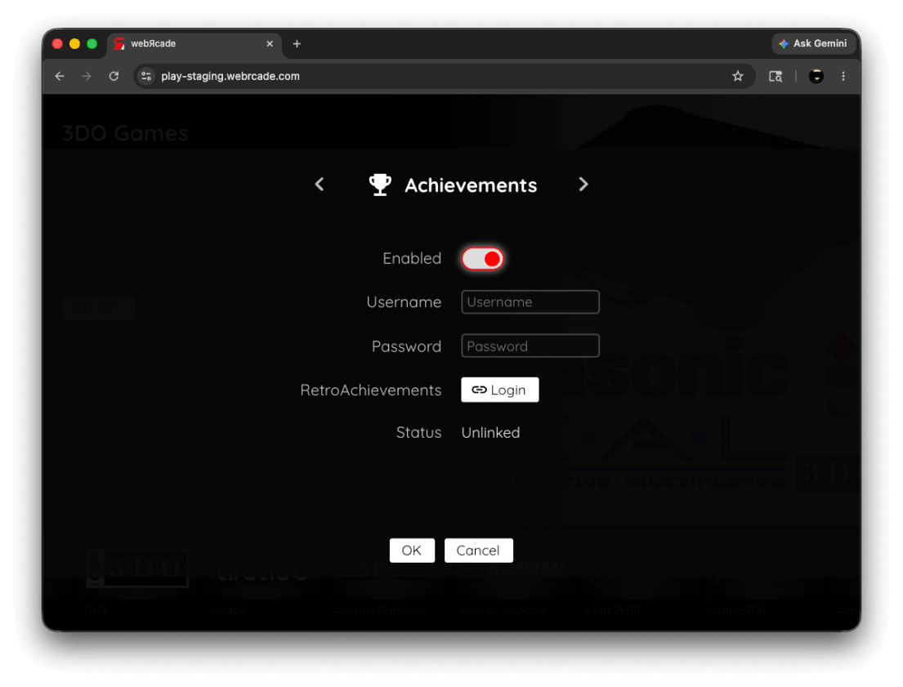
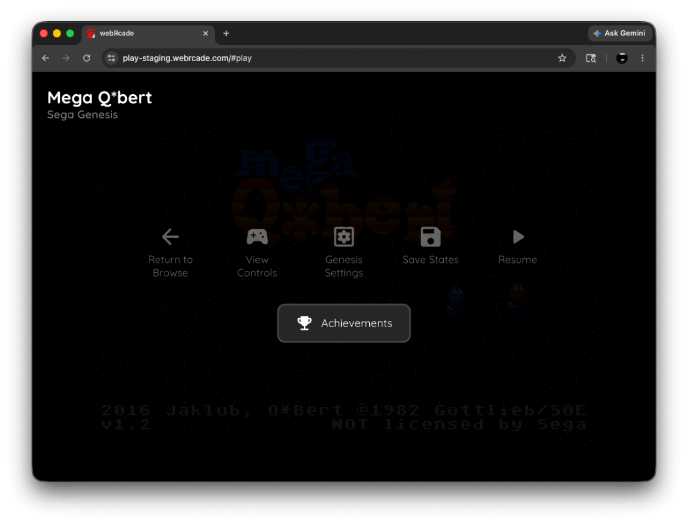
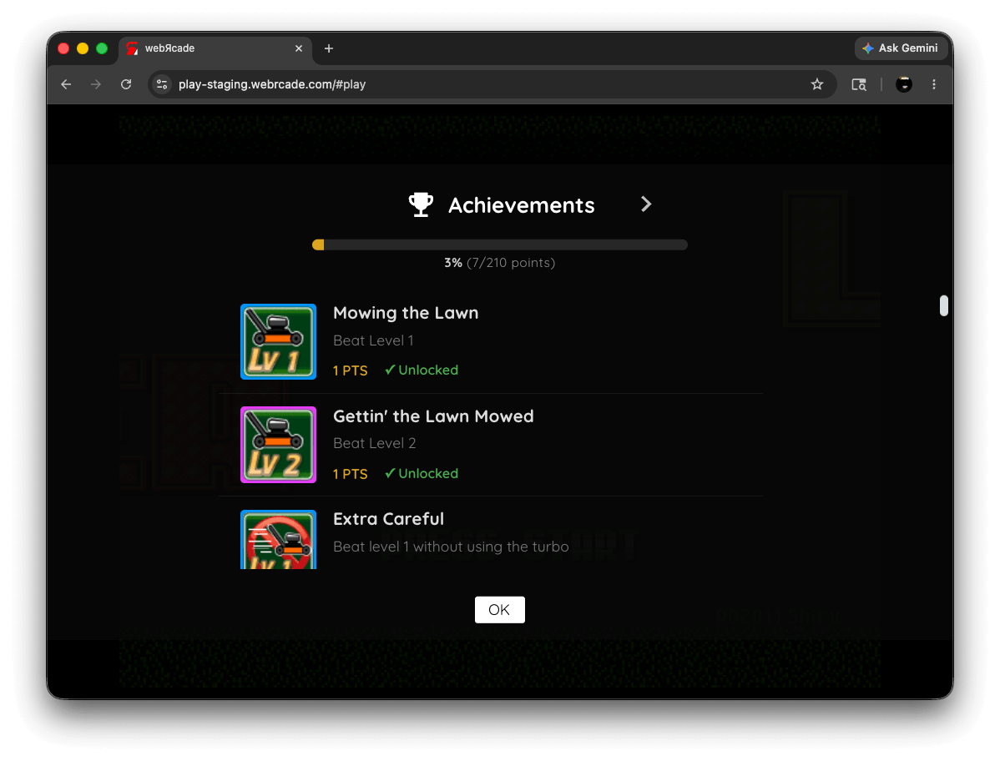
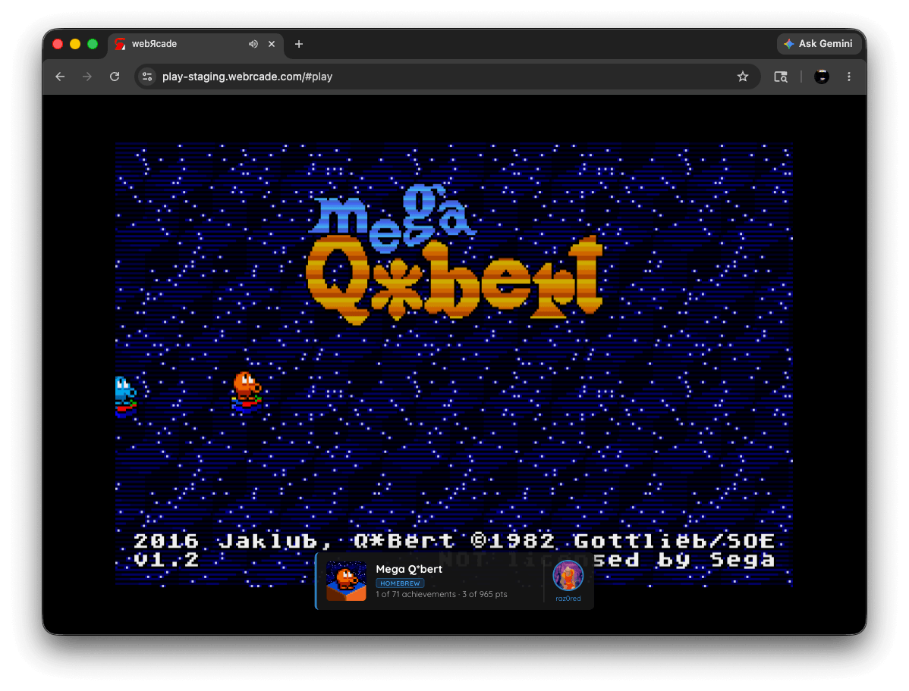
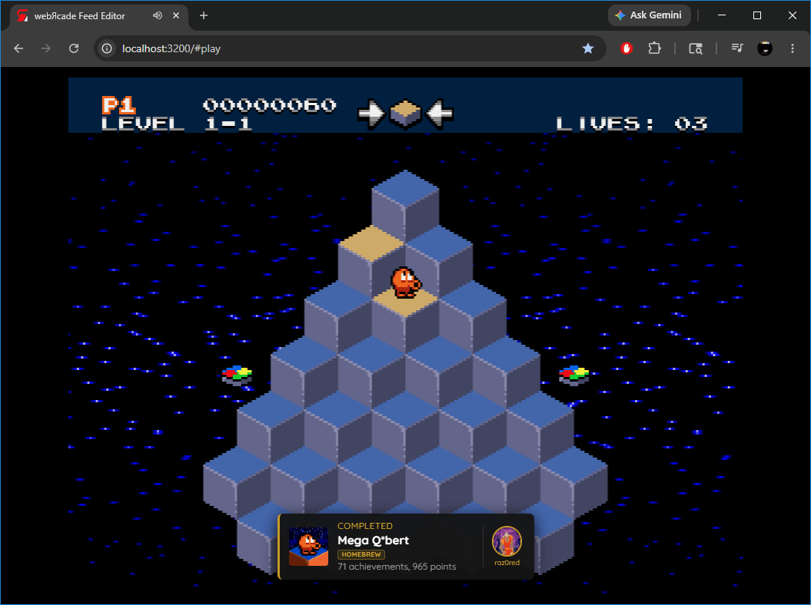
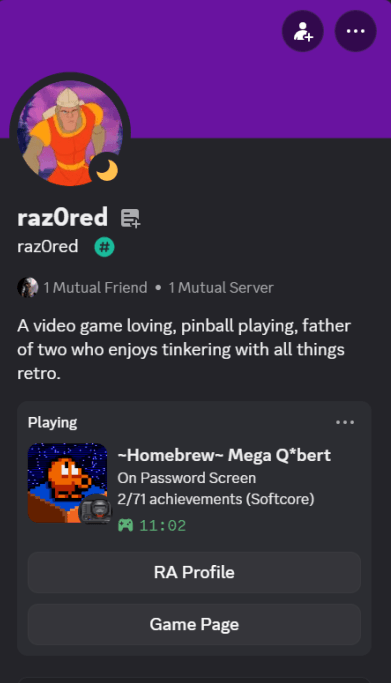

# RetroAchievements

webЯcade supports [RetroAchievements](https://retroachievements.org){target=_blank}, a community-driven achievement system for classic games. When enabled, webЯcade will communicate with the RetroAchievements service to unlock achievements, track progress, and display notifications while you play.

!!! note
    A free RetroAchievements account is required to use this feature. You can create one at [retroachievements.org](https://retroachievements.org){target=_blank}.

!!! warning
    Hardcore mode is not currently supported.

## Overview

{: style="padding:5px;" class="center zoomD"}

RetroAchievements support is available for a subset of webЯcade's emulator applications. Refer to the individual [application pages](../apps/index.md) for details on which emulators support achievements.

## Enabling RetroAchievements

RetroAchievements must be enabled and configured in the webЯcade player settings before achievements will be tracked.

{: style="padding:5px;" class="center zoomD"}

To configure RetroAchievements:

1. Open the **Settings Dialog** from the webЯcade player (see [Settings Dialog](index.md#settings-dialog)).
2. Navigate to the **Achievements** tab.
3. Toggle **Enabled** on.
4. Enter your RetroAchievements **Username** and **Password**.
5. Select the **Login** button next to the RetroAchievements row.

The settings in the Achievements tab are described below:

| __Field__ | __Description__ |
| --- | --- |
| Enabled | Toggles RetroAchievements support on or off. |
| Username | Your RetroAchievements account username. Only shown when *Enabled* is on and you are not yet logged in. |
| Password | Your RetroAchievements account password. Only shown when *Enabled* is on and you are not yet logged in. |
| RetroAchievements | Only shown when *Enabled* is on. Select *Login* to authenticate with RetroAchievements using the username and password entered above. Once logged in, the button changes to *Logout*. Select it to disconnect your account. |
| Status | Indicates whether your account is currently logged in (*Linked*) or not (*Unlinked*). Only shown when *Enabled* is on. |

## Achievements in the Pause Screen

When a game with RetroAchievements support is running, an **Achievements** option is available in the [Pause Screen](index.md#pause-screen).

{: style="padding:5px;" class="center zoomD"}

Selecting **Achievements** from the pause screen displays the achievement list for the current game, showing which achievements have been earned and which are still locked.

{: style="padding:5px;" class="center zoomD"}

## Notifications

### Game Loaded

When a game with RetroAchievements support is started, a placard appears briefly showing:

- The game's badge image
- The game title and any associated tags
- Your current progress: how many achievements you have earned and the total available, along with point counts (e.g., *5 of 32 achievements · 120 of 400 pts*)
- Your RetroAchievements username and avatar

If the game has no achievements, the placard will display *No achievements available for this game* instead.

{: style="padding:5px;" class="center zoomD"}

### Achievement Unlocked

Whenever you earn an achievement during play, a notification appears showing the achievement's badge, title, and description.

{: style="padding:5px;" class="center zoomD"}

### Mastery

When you earn every achievement in a game, a *Completed* notification is displayed showing the game badge, game title, total achievement and point counts, and your username and avatar.

{: style="padding:5px;" class="center zoomD"}

## Discord Rich Presence (RAD Presence)

[RAD Presence](https://radpresence.com){target=_blank} is a companion project from the webЯcade developers that automatically mirrors your RetroAchievements session to your Discord Rich Presence. When you are playing a game, Discord will show your current game, cover art, achievement progress, and more in real time.

{: style="padding:5px;" class="center zoomD"}

RAD Presence runs as a silent native background service (Windows, macOS, and Linux) that starts automatically on login. No runtime or installer is required. It ships as a single binary.

For installation and setup instructions, visit [radpresence.com](https://radpresence.com){target=_blank} or the [RAD Presence GitHub repository](https://github.com/raz0red/RADPresence){target=_blank}.

## Notes

- RetroAchievements requires an active internet connection during play.
- Only certain webЯcade applications support RetroAchievements. Refer to the individual [application pages](../apps/index.md) for details.
- Progress is synced to the RetroAchievements service in real time as achievements are earned.
